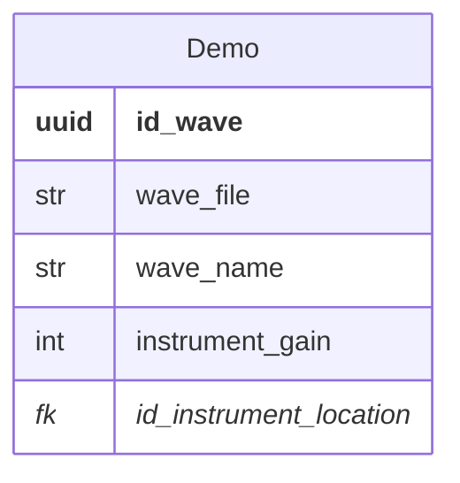

# Getting started

Demo diagram.

```mermaid
erDiagram
    Demo {
        **uuid** **id_wave**
        str wave_file
        str wave_name
        int instrument_gain
        _fk_ _id_instrument_location_
    }
```
